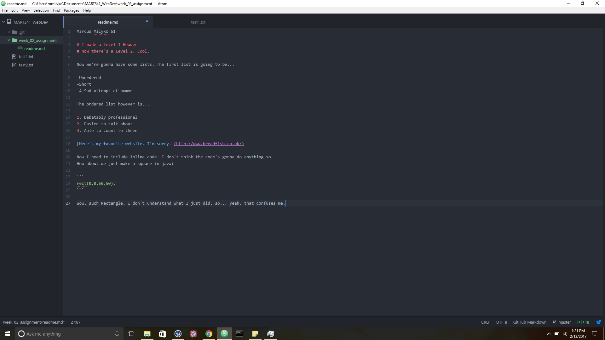

Marcus Milyko 51

# So this is my Homework, starting with a Level 1 Header
# Now there's a Level 2. Cool.

Now we're gonna have some lists. The first list is going to be...

-Unordered
-Short
-A Sad attempt at humor

The ordered list however is...

1. Debatably professional
2. Easier to talk about
3. Able to count to three

[Here's my favorite website. I'm sorry.](http://www.breadfish.co.uk/)

Now I need to include Inline code. I don't think the code's gonna do anything so...
How about we just make a square in java?

```
rect(0,0,50,50);
```

Wow, such Rectangle. I don't understand what I just did, so... yeah, that confuses me.



I mostly just floundered about for most of this week. I'm not very at online interactivity, so I don't really help or get helped online... I most just struggle to figure out what I'm supposed to be doing until I eventually give up and go ask for help in person.
