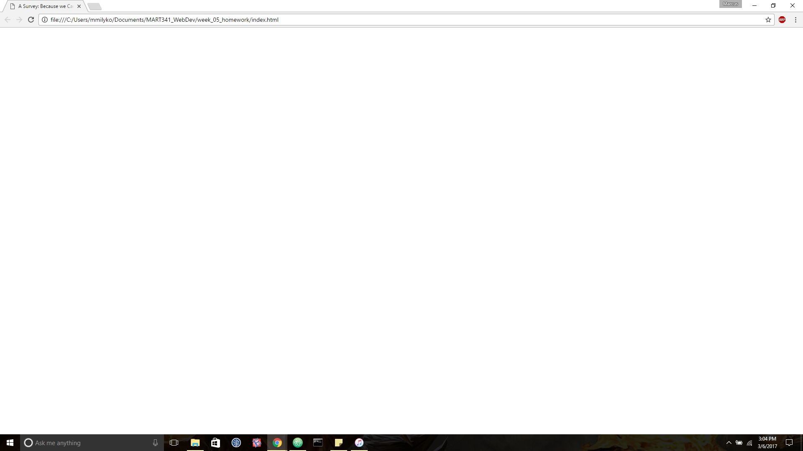
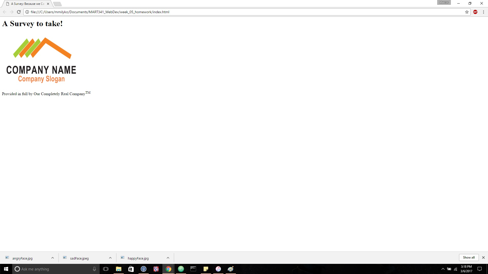
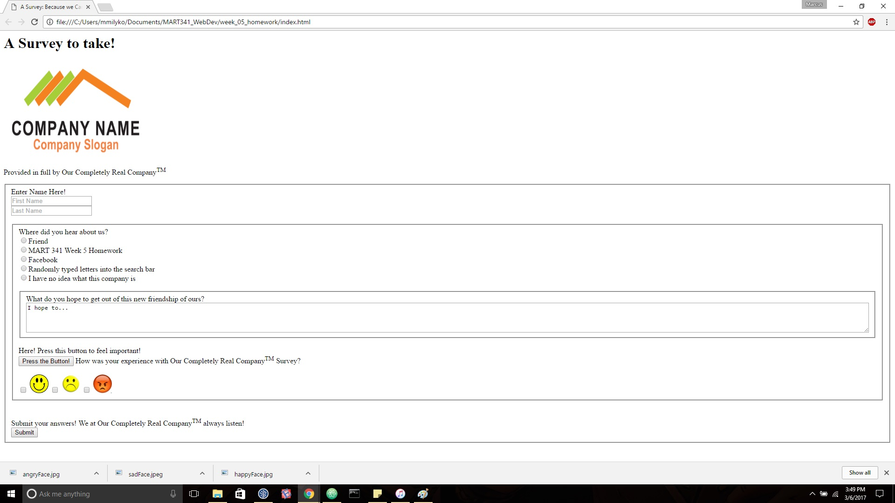

This week was actually one of the easier weeks -- especially compared to the incredibly dense Week 4 assignment. I found forms exceptionally simple, and that made things this week go quite well. I struggled a little with images, but I fairly quickly grasped the use of them with the help of the example for the week (so thanks for that).

First, I went through creating the  -- this was the first week I was able to make the base webpage without using my notes, so hoorah! It's always good to see myself improve, so that makes me happy. Next, I spent a while focusing on how to make images work with the logo I found online. It went incredibly well, and I ended up with a good . After that, I added all the forms, and things worked perfectly right out of the gate. I performed a few small changes, and had a  in no time.

I'm very satisfied with this week, and I'm glad I'm starting to get a hold of everything!
