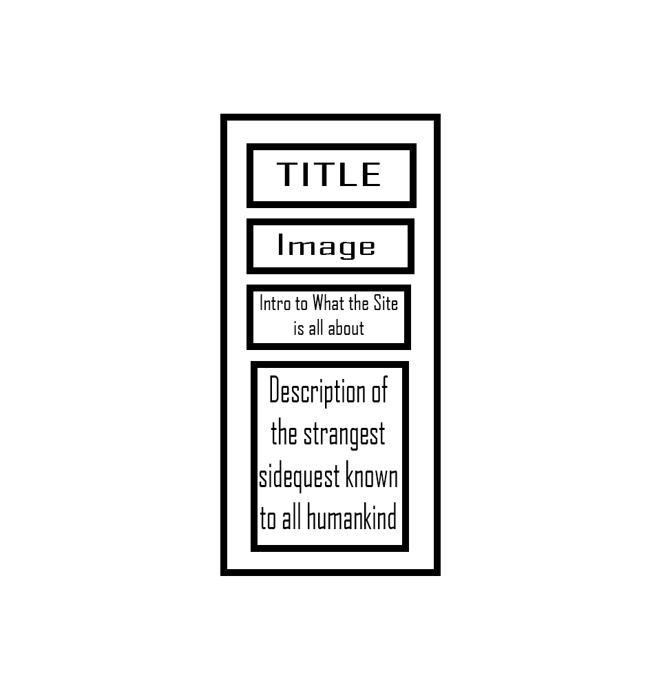
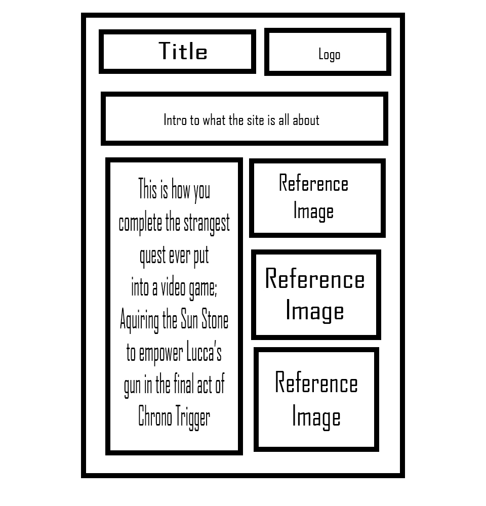
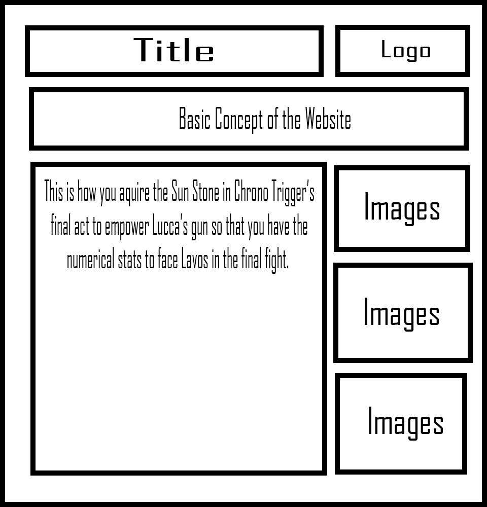

This week was initially incredibly difficult since I struggled wrapping my mind around (of all things), wireframes. As soon as they were explained, everything went fine. From this, I've then realized I have two major issues when it comes to css and html.

First, I struggle with the manipulation of text size when applying RWD. However, in terms of images and such, I find RWD easy to learn. Second, and by far the largest problem, I cannot for the life of me figure out how to incorporate second and third columns into design. All of them suffer from the same issue as my Week 09 homework, that the box that creates the second column doesn't ever seem to listen to RWD -- I can never figure out what position type to use in css, meaning everything very quickly descends into madness.

This site works as a RWD because anyone using it would either be on phone while they're playing the game I have the walkthrough for or are looking it up on computer -- which means this should function for both those large categories. Because of this, I had to give up on my tablet and desktop ideas and create a new design.

Hopefully, I figure out columns for the final -- I feel like that'd be helpful.

